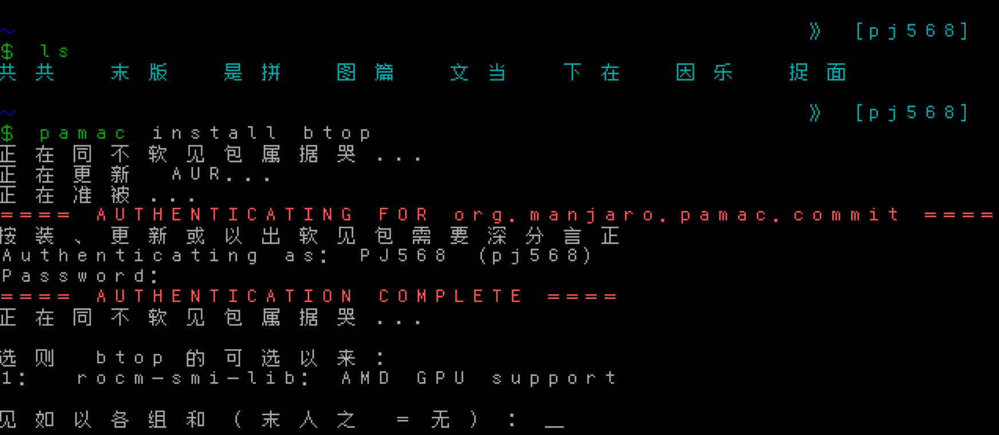

# 

> [简体中文](README.md) | ENGLISH

## font-xibo

Xibo is a Chinese TTY font designed for Linux, aiming to provide Chinese display in TTY without installing kernel patches such as [cjktty](https://github.com/zhmars/cjktty-patches) or third-party software like [kmscon](http://www.freedesktop.org/wiki/Software/kmscon), [fbterm](https://salsa.debian.org/debian/fbterm), or [zhcon](https://zhcon.sourceforge.net/).

The inspiration for this project comes from the [syllazh](https://github.com/oldherl/syllazh/) font.

## Phonetic Characters

When using this font, you may notice that characters with similar pronunciations are displayed as the same character. For example, any of the characters "用永勇拥擁涌湧咏詠蛹雍踊庸踴泳" will be uniformly displayed as "用".

This is because fonts on Linux TTY are generally changed using the `setfont` tool from the kbd package, which supports a maximum of 512 glyphs. However, a single glyph can map to multiple Unicode code points.
Therefore, Xibo maps all characters with the same pronunciation (ignoring tones) to the same glyph, allowing for Chinese character display within the limited number of glyphs.

## Building the Font

1. Clone the repository:

   ```shellscript
   git clone https://github.com/PJ-568/font-xibo.git
   cd font-xibo
   ```

2. Install dependencies:

   ```shellscript
   pip install -r requirements.txt
   ```

3. Build the font:

   ```shellscript
   bash build.bash
   ```

   During the build process, the script will install `psftools`, which is used to generate the font.

After building, a PSF2 font file named `xibo.psfu.gz` will be generated in the `output/` directory.

## Using the Font

> Ensure that the version of the `setfont` command is `2.6rc1` or higher.
> Versions prior to `2.6rc1` do not support fonts larger than 65535 (approximately 64KB).
> After `2.6rc1`, the limit has been relaxed to 4194304 (approximately 4MB).
>
> Run `setfont -V` to check the version.

Place `xibo.psfu.gz` in the `consolefonts` directory (located at `/usr/share/consolefonts/` on Debian and `/usr/share/kbd/consolefonts/` on Arch Linux), then execute `setfont xibo` to change the font or `setfont -d xibo` to switch to a double-sized font.

## License

> Thanks to the **WenQuanYi** team for providing the `WenQuanYi Bitmap Song v1.0.0-RC1 Hero` font.

The script files `build.bash` and `build_font_from_bdf.py` in this repository are licensed under the [GNU GENERAL PUBLIC LICENSE Version 3](LICENSE).
All reference files in the `original/references/` directory are licensed under the [Unlicense](original/references/LICENSE).
The generated font files in this project are licensed under the [Free Chinese Font License and GNU GENERAL PUBLIC LICENSE Version 2](FONT-LICENSE).

## Contributing

Refer to the [Contribution Guide](CONTRIBUTING.md).
