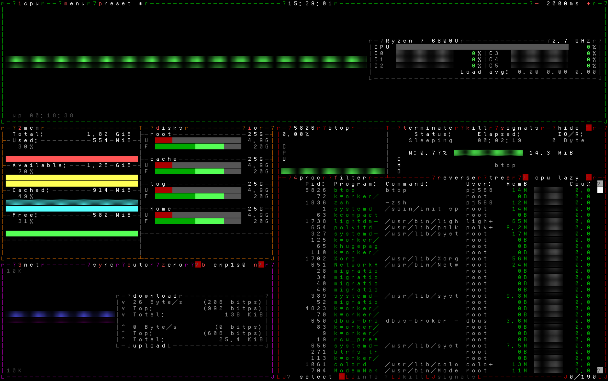

# 

> ENGLISH | [简体中文](README.md)

## font-cengluan（层峦字体）

cengluan is a Chinese TTY font designed for Linux, aiming to provide Chinese display in TTY without installing kernel patches such as [cjktty](https://github.com/zhmars/cjktty-patches) or third-party software like [kmscon](http://www.freedesktop.org/wiki/Software/kmscon), [fbterm](https://salsa.debian.org/debian/fbterm), or [zhcon](https://zhcon.sourceforge.net/).

The inspiration for this project comes from the [syllazh](https://github.com/oldherl/syllazh/) font.

### Phonetic Characters

When using this font, you may notice that characters with similar pronunciations are displayed as the same character. For example, any of the characters "用永勇拥擁涌湧咏詠蛹雍踊庸踴泳" will be uniformly displayed as "用".

This is because fonts on Linux TTY are generally changed using the `setfont` tool from the kbd package, which supports a maximum of 512 glyphs. However, a single glyph can map to multiple Unicode code points.
Therefore, cengluan maps all characters with the same pronunciation (ignoring tones) to the same glyph, allowing for Chinese character display within the limited number of glyphs.

### Terminal User Inerface Display Optimization

This font also optimizes the mapping of commonly used graphical symbols in terminals to make them more suitable for terminal use. Some examples:

- Original symbols:

  ```plaintext
  ┌───┬───┐
  │   │   │
  ├───┼───┤
  │   │   │
  └───┴───┘
  ```

- Before optimization:

  (Cannot be displayed correctly)

- After optimization:

  ```plaintext
  r---T---7
  |   |   |
  ├---+---┤
  |   |   |
  L---┴---J
  ```

  Among these, `┌` is mapped to the letter `r`, `┬` is mapped to the letter `T`, `┘` is mapped to the letter `J`, etc.
  This type of mapping maximizes the improvement of display quality without occupying more glyphs (:-D).

  

### Character Width Display Optimization

In regular text display scenarios:

- **Full-width characters** (such as Chinese characters and symbols in GB2312) have a display width of two units (occupying two character positions) and a height of one character line (occupying one line height);
- **Half-width characters** (such as English letters, Arabic numerals, and ASCII punctuation) have a display width of one unit and the same height as one character line.

This means: Chinese characters and symbols in GB2312 encoding are full-width, while ASCII characters and English symbols (such as commas, periods) are typically half-width.

However, PC Screen Font 2 (PSF2) is a fixed-width bitmap font format that does not support characters of different sizes (widths) within a single font.
This leads to:

- If all characters are displayed with a width of one unit: full-width characters only show the left half, with the right half displaying the [thirty-second character](#thirty-second-character);
- If all characters are displayed with a width of two units: all half-width characters occupy two columns, but visually only have a width of one unit, resulting in [large gaps between half-width characters](assets/display_old.png).

Given the high difficulty of finding or designing "tall and narrow half-width monospace Chinese fonts" or "compatible full-width English letter fonts",
font-cengluan maps all English letters, Arabic numerals, ASCII punctuation, and other characters to full-width characters in the UTF-8 high range.
Although each Chinese character is still separated by a [thirty-second character](#thirty-second-character), font-cengluan achieves a relatively balanced visual appearance overall.

### Thirty-second Character

The thirty-second character in Linux TTY fonts defaults to `U+20`, which is a space. This character is used to fill positions in the background where no character is present.

## Building the Font

1. Clone the repository:

   ```shellscript
   git clone https://github.com/PJ-568/font-cengluan.git
   cd font-cengluan
   ```

2. Install dependencies:

   ```shellscript
   pip install -r requirements.txt
   ```

3. Build the font:

   ```shellscript
   bash build.bash
   ```

   During the build process, the script will install `psftools`, which is used to generate the font.

After building, a PSF2 font file named `cengluan.psfu.gz` will be generated in the `output/` directory.

## Using the Font

> Ensure that the version of the `setfont` command is `2.6rc1` or higher.
> Versions prior to `2.6rc1` do not support fonts larger than 65535 (approximately 64KB).
> After `2.6rc1`, the limit has been relaxed to 4194304 (approximately 4MB).
>
> Run `setfont -V` to check the version.

Place `cengluan.psfu.gz` in the `consolefonts` directory (located at `/usr/share/consolefonts/` on Debian and `/usr/share/kbd/consolefonts/` on Arch Linux), then execute `setfont cengluan` to change the font or `setfont -d cengluan` to switch to a double-sized font.

## License

> Thanks to [oldherl](https://github.com/oldherl) for their forward-looking technical exploration project [syllazh](https://github.com/oldherl/syllazh/);
>
> Thanks to **TakWolf** and their team for providing the `fusion-pixel-font` font.

The script files `build.bash`, `build_font_from_bdf.py`, and all files in the `scripts/` directory in this repository follow the [GNU GENERAL PUBLIC LICENSE Version 3](LICENSE),
`original/references/pinyin_hanzi` in the `original/references/` directory follows the GNU Lesser General Public License (LGPL) 2.1, and other reference files follow the [Unlicense license](original/references/LICENSE),
The font files generated by this project follow the [MIT license](MIT-LICENSE) or [SIL OPEN FONT LICENSE Version 1.1](SIL-LICENSE). For the original font upstream licenses, see the files in [`FONT-LICENSE/`](FONT-LICENSE/).

## Contributing

Refer to the [Contribution Guide](CONTRIBUTING.md).
