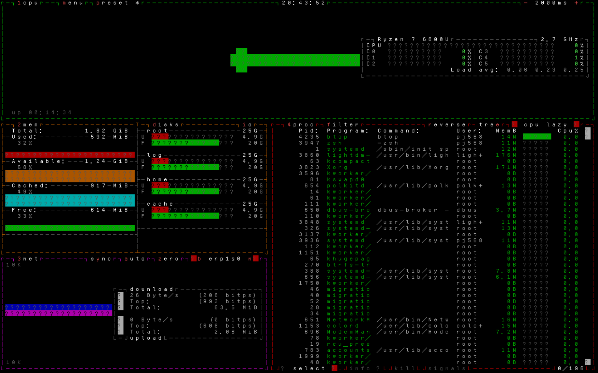

# 

> [ENGLISH](README.en.md) | 简体中文

## font-xibo

xibo 是一个为 Linux 设计的中文 TTY 字体，旨在在不安装诸如 [cjktty](https://github.com/zhmars/cjktty-patches) 等内核补丁，
且不安装 [kmscon](http://www.freedesktop.org/wiki/Software/kmscon)、[fbterm](https://salsa.debian.org/debian/fbterm)
或 [zhcon](https://zhcon.sourceforge.net/) 等第三方软件的环境下提供 TTY 中文显示。

本项目的灵感来源自 [syllazh](https://github.com/oldherl/syllazh/) 字体。

### 表音文字

在使用本字体时，您可能注意到——读音相近的汉字会被统一显示为同一个汉字，如：“用永勇拥擁涌湧咏詠蛹雍踊庸踴泳”中的任意一个汉字会被会统一显示为“用”。

这是因为 Linux TTY 上的字体一般用 kbd 软件包的 setfont 工具更换。它最多支持 512 个字形（glyph），但单个字形可以映射到多个 Unicode 码位。
因此，xibo 将所有忽略声调的音节相同的汉字都会被映射到同一个字形上，以实现在有限字形数下的汉字显示。

### 终端图形程序显示优化

本字体还针对终端部分常用的图形符号进行优化映射，使其更适合终端使用。部分示例：

- 原符号：

  ```plaintext
  ┌───┬───┐
  │   │   │
  ├───┼───┤
  │   │   │
  └───┴───┘
  ```

- 优化前：

  （无法正确显示）

- 优化后：

  ```plaintext
  r---T---┐
  |   |   |
  ├---+---┤
  |   |   |
  L---┴---J
  ```

  其中，`┌` 被映射为字母 `r`，`┬` 被映射为字母 `T`，`┘` 被映射为字母 `J` 等。
  此类映射在尽量不占用更多字形的情况下最大程度地改善了显示效果（:-D）。

  

### 字宽显示优化

在常规情景的文本显示中：

- **全角字符**（如 GB2312 中的汉字和中文符号）的显示宽度为二个单位（占用两个字符位置），高度为一个字符行（占用一行高度）；
- **半角字符**（如英文字母、阿拉伯数字、ASCII 标点符号）的显示宽度为一个单位，高度同为一个字符行。

也就是说：GB2312 编码中的汉字和中文符号为全角，而 ASCII 字符和英文符号（如逗号、句点）通常为半角。

然而，PC Screen Font 2（PSF2）是一个固定宽度的位图字体格式，不支持在单个字体中存在不同大小（宽度）的字符。
导致，若：

- 所有字符以宽一个单位显示：全角字符仅显示左半截，右半截显示为字体中的[第三十二个字符](#第三十二个字符)；
- 所有字符以宽二个单位显示：所有半角字符占满两行，但视觉宽仅一单位，导致[两个半角字符间有大空隙](assets/display_old.png)。

鉴于寻找和设计“瘦高半角等宽汉字等字体”或“适配的全角英文字母等字体”的高难度。
font-xibo 将所有英文字母、阿拉伯数字、ASCII 标点符号等字映射为 UTF-8 高位的全角字符。
虽每个汉字间仍被一个[第三十二个字符](#第三十二个字符)隔开，font-xibo 在总体视觉上达到相对平衡。

### 第三十二个字符

Linux TTY 默认第字体的三十二个字符为 `U+20`，既空格。这个字符被用来填充背景中没有字符的位置。

## 构建字体

1. 克隆仓库：

   ```shellscript
   git clone https://github.com/PJ-568/font-xibo.git
   cd font-xibo
   ```

2. 安装依赖项：

   ```shellscript
   pip install -r requirements.txt
   ```

3. 构建字体：

   ```shellscript
   bash build.bash
   ```

   在构建过程中，脚本会安装 `psftools`，用于生成字体。

构建完成后，会在 `output/` 生成一个名为 `xibo.psfu.gz` 的 PSF2 字体文件。

## 使用字体

> 请确保 `setfont` 命令的版本为 `2.6rc1` 或更高。
> 此版本之前的 setfont 不支持压缩前大于 65535（约 64KB）的字体。
> 在 `2.6rc1` 之后，上述限制放宽到了 4194304（约 4MB）。
>
> 执行 `setfont -V` 以检查版本。

将 `xibo.psfu.gz` 放入 `consolefonts` 目录下（在 Debian 中位于 `/usr/share/consolefonts/`、在 Arch Linux 中位于 `/usr/share/kbd/consolefonts/`），执行 `setfont xibo` 更换字体或执行 `setfont -d xibo` 切换到两倍大小的字体。

## 许可协议

> 感谢 [oldherl](https://github.com/oldherl) 的前瞻技术探索项目 [syllazh](https://github.com/oldherl/syllazh/)；
>
> 感谢 **TakWolf** 及其团队提供的 `fusion-pixel-font` 字体。

本仓库中的脚本文件 `build.bash`、`build_font_from_bdf.py` 和 `scripts/` 中的所有文件遵循 [GNU GENERAL PUBLIC LICENSE Version 3 许可协议](LICENSE)，
`original/references/` 目录下的 `original/references/pinyin_hanzi` 遵循 GNU Lesser General Public License (LGPL) 2.1，其余参照文件遵循 [Unlicense 许可协议](original/references/LICENSE)，
本项目生成的字体文件遵循 [MIT 许可协议](MIT-LICENSE)或 [SIL OPEN FONT LICENSE Version 1.1 许可协议](SIL-LICENSE)，原字体上游协议详见 [`FONT-LICENSE/`](FONT-LICENSE/) 下文件。

## 做出贡献

请参照[贡献指北](CONTRIBUTING.md)。
